<h4 align="center">ASSESSMENT (Period 3)</h4>
<h4 align="center">DATA ANALYST PROGRAM</h4>
<h4 align="center">TATYANA KETOVA DA-23</h4>

<h1 align="center">”Voice analysis. Voice sex recognizer using classification models and neural network.”</h1>

While studying at Hyper Island, I gained experience analyzing data from buyers and visitors to the Kitchen Lab website, analyzing data from various open sources - student performance, food prices, participation, and actors' fees in movies and TV shows. I also analyzed the location data of Volvo trucks and their technical characteristics, and the last project was analyzing user usage data of the fish brain application.

For my project, I chose the topic based on two criteria: since I will be doing my practice at AI Sweden, I wanted to get an initial understanding of how data is used when training neural networks, and the second was my desire to work with an unusual type of data, that is, that it be not just understandable numbers like the number of potatoes sold or the number of site visitors. As a result, I chose the topic of analyzing the data of human voices and also tried to build a model based on voices that determine the speaker's characteristics by voice.

### S10 - PLAN, EXECUTE AND IDENTIFY RESOURCES FOR CARRYING OUT EXPERIMENTS TO DRAW DATA-INFORMED CONCLUSIONS

To conduct experiments, I needed to find a database of voices from an open source. A **suitable database** on the kaggle.com website contains more than 2000 speech samples; this database contained recordings of people from all over the world. Speakers come from 177 countries and have 214 different accents. Each speaker says the same text in English. My computer can process this number of records, although it will take some time.

I chose **Python** for this project because it is open-source itself and has various open-source free-to-use libraries, graphics, and visualization. While studying at Hyper Island, I gained experience in data analysis in Python using the pandas and Sklearn libraries and expertise in creating various visualizations using matplotlib, CloudWord, and Folium. Therefore, I did not doubt that I would find a suitable Python library that would allow me to process audio into a convenient form for analysis.

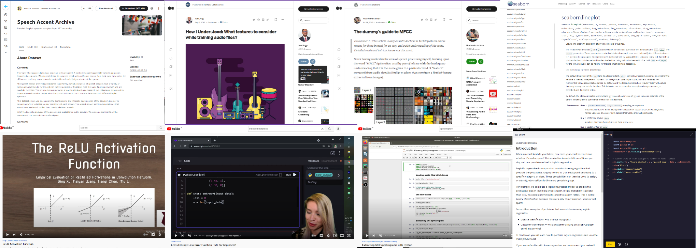

Before starting work with this database, I spent some time studying the topic of sound and voice. I covered the topics: “What is sound,” “Sound characteristics,” “voice characteristics,”,” How does a person's voice change with age”, and “What is the difference between the period of teenage voice mutation in girls and boys”, “How we hear” and so on.

The process of decomposing sound into frequencies in the cochlea of ​​the human ear for recognition by the brain is similar to the operation of decomposing sound using a Python library. It is called **Librosa**, which suited my need well. It is a python package for music and audio analysis, which process an audio file and extracts features from it. Later, as I worked with audio files, I met **Librosa.display**, which visualizes a waveform in the time domain, **IPython.display** which allows me to play audio files, and **ffmpeg** allows get audio file sample rate. The blogs and articles of data scientists and lectures from deep learning school helped me understand what features of sound can be used to train a neural network, how to visualize them, and how to understand the resulting visualization.

I will use the pandas and NumPy library for data preparation and cleaning, for visualization **matplotlib**, **seaborn**, **plotly**, and **Librosa.display**. For neural network creation and analysis, I will use **Sklearn** and **NumPy** library. Additionally, I need the **Os** library and **Random** library to work with files and to get random weight values before training the neural network. I trained a neural network to recognize sex without ready-made libraries for Python because I wanted to understand the process of training a neural network. Thus, I had to study many topics related to neural networks. I also tried to create another neural network for accent recognition using the keras library, but I got very low accuracy (about 0.46). I assumed the accuracy would be low because very often only one or two recordings represent the accent.

**The selected resources allowed me to eventually train the neural network to recognize sex by voice and build various classification models. I understand that my project is not innovative but rather the first personal step in the field of neural networks, and I used resources that have already been developed for working with data and sound.**

### C3 - INDEPENDENTLY BE ABLE TO WORK METHODICALLY AND FLEXIBLY IN VARIOUS PROJECTS AND PROCESSES

It was the first independent project during my studies in Hyper Island, so it assumed in advance independent work.

The first thing that had to be done for me was to determine the **personal goals** of the project, **my interests**, **my strengths**, **and my needs**, build a rough plan and adjust it depending on the achieved results.

I defined my personal goal in this project as "Gain experience in creating a simple neural network.” I wrote down a plan that I would like to follow in the process of working on the project:

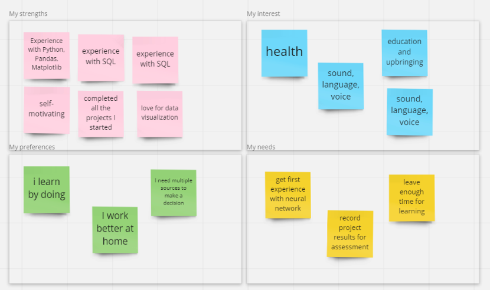

| Stage                                                                                 | Substage                                                                                                                                                                                                                                 |
|---------------------------------------------------------------------------------------|------------------------------------------------------------------------------------------------------------------------------------------------------------------------------------------------------------------------------------------|
| **1 Working with audio (studying the topic)**                                         | 1. Exploring the theme of the human voice 2. The study of modern developments in the field of voice recognition, its synthesis, scoring, etc.  3. Studying Python(necessary libraries)                                           |
| **2 Audio processing**                                                                | 1. Writing and retrieving parameters from a single file  2. The function of extracting and processing 2200 files                                                                                                                     |
| **3 Preparing and exploring the database Normalizing and adding data from audio** | 1. Database check for missing data and outliers, clean  2. Exploring the database  3. Studying Python library seaborn  4. Visualization of results                                                                           |
| **4 Gender classification model**                                                     | 1. Studying the kinds of classification models  2. Studying implementing models in Python (library sklearn)  3. Preparing data  4. Create models  5. Estimation of the model’s accuracy  6. Visualization of results |
| **5 Creating a neural network to determine the sex  of the speaker**                  | 1. Studying creating a neural network in Python  2. Preparing data  3. Create neural network  4. Estimation of neural network accuracy  5. Changing structure and hyperparameters  6. Visualization of results       |
| **6 Creating a neural network to determine the sex and accent of the speaker**        | 1. Studying creating a neural network by libraries  2. Preparing data  3. Create neural network  4. Estimation of neural network accuracy                                                                                                                         |
| **7 Preparing a presentation**                                                        |                                                                                                                                                                                                                                                                               |
| **8 Assessment Preparation**                                                          |                                                                                                                                                                                                                                                                               |

This is my initial work plan for the project. Some steps took a very long time. I followed this plan, but sometimes I had to return to some stages. For example, when preparing for a presentation, I had to return to understanding the human voice again to select the audience's most appropriate and essential explanations.

The most challenging thing in working on a project on ones own is to assess whether the step’s result was satisfactory, but at the same time, it was easy to return to the previous step to redo something.

Since the area is new for me, one of the criteria for evaluating each stage was **how much I now understand this area**. Also, the criterion for evaluating the project was **how well I coped with the set stages**.  This is my assessment of myself in the chart below.

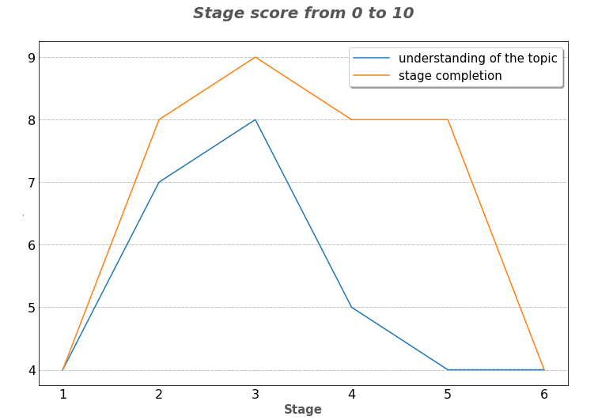

The first stage was rated low. It turned out that the topic of sound and voice was quite complicated. Many nuances opened up for me, like what Mel scale. Mel scale is a scale that relates the perceived frequency of a tone to the actual measured frequency. It scales the frequency to match more closely what the human ear can hear (humans are better at identifying small changes in speech at lower frequencies). This scale has been derived from sets of experiments on human subjects. The "Preparing and exploring the database" step was more straightforward because I had already done this in previous projects.

And the stage of creating a neural network is interesting in that I made a working neural network, but I can’t say in the affirmative that I understood this topic. I have to return to the sources.

**I independently covered a relatively large range of topics. I sometimes had to go back a few steps when new details of a particular topic were revealed. I independently assessed whether I paid enough attention to a specific stage and whether I should proceed to the next one.**

### C1 - PROCESS AND ANALYZE DATA IN SUCH A WAY THAT IT LEADS TO FURTHER LEARNING AND PROFESSIONAL DEVELOPMENT

After clearing the data and removing duplicate entries, I created several visualizations to understand how they are distributed across my database.

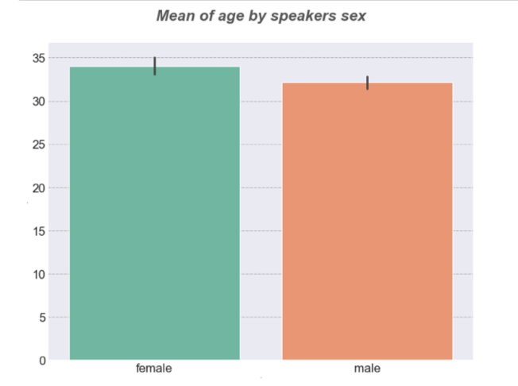

1096 male and 1022 female voices in the database; the average age is around 30-35 years old. The age distribution is right-skewed. Most of the recordings are young people, which means young voices.
The number of entries submitted in a native language is not evenly distributed. Below are the top 50 by a number of entries based on the speaker’s native language. **579 people** - the largest group represented with English as their native language.

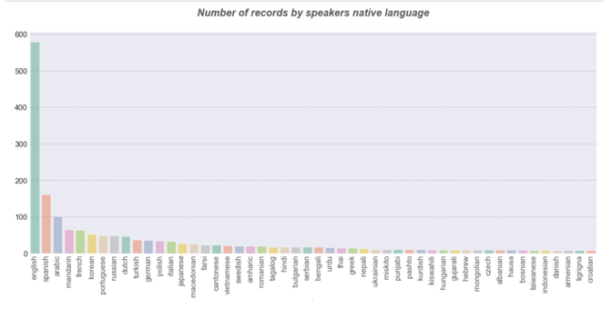

Since there are many native languages, I divided them into groups depending on the number of records presented.

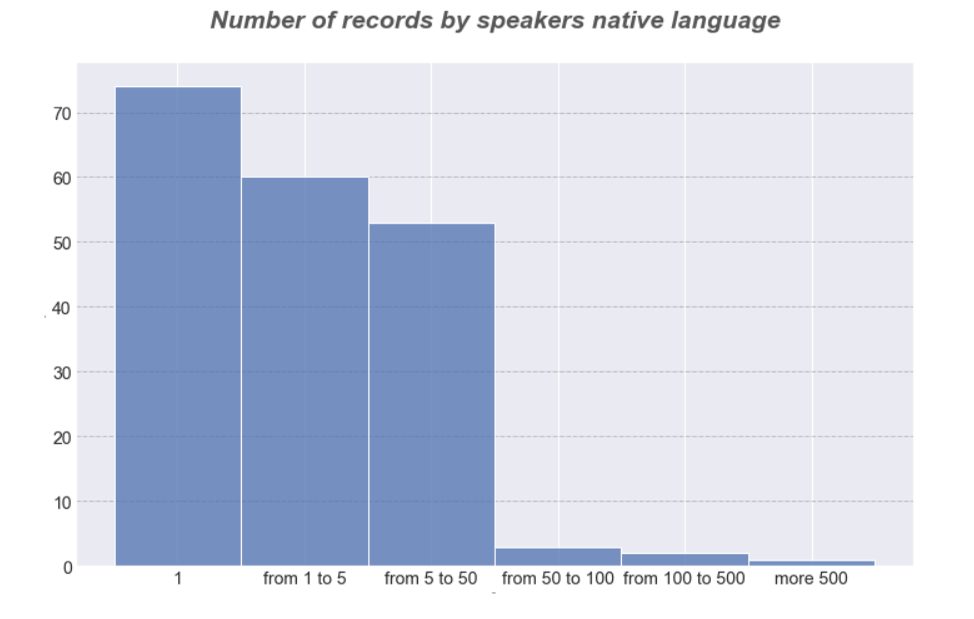

The next step was to process audio signals., I got acquainted with the Librosa library. I extracted MFCC sound features - **Mel Frequency Cepstral Coefficients**.

I got **32 parameters**, normalized them, and put them into the database according to each audio file.

Any sound generated by a human voice is determined by the shape of the vocal tract (including the tongue, teeth, etc.). Therefore, I decided to compare the average MFCC values depending on the **speaker’s sex**.

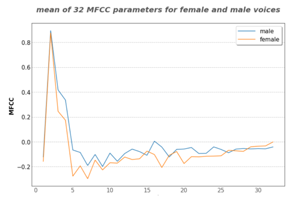

The graph shows that the average values of the MFCC variables are different. I thought this would allow the creation of a model that could predict with a high probability whom the voice on the recording belongs to - a man or a woman.

To do this, after preparing the data frame and dividing it into a training and test part, using the sklearn library, I tried **Logistic Regression, K Nearest Neighbor Algorithm, Support Vector Machines (SVM) -Linear Function, Polynomial Function, Radial Basis Function (RBF), Random Forest Classifier, Decision Tree Classifier**.

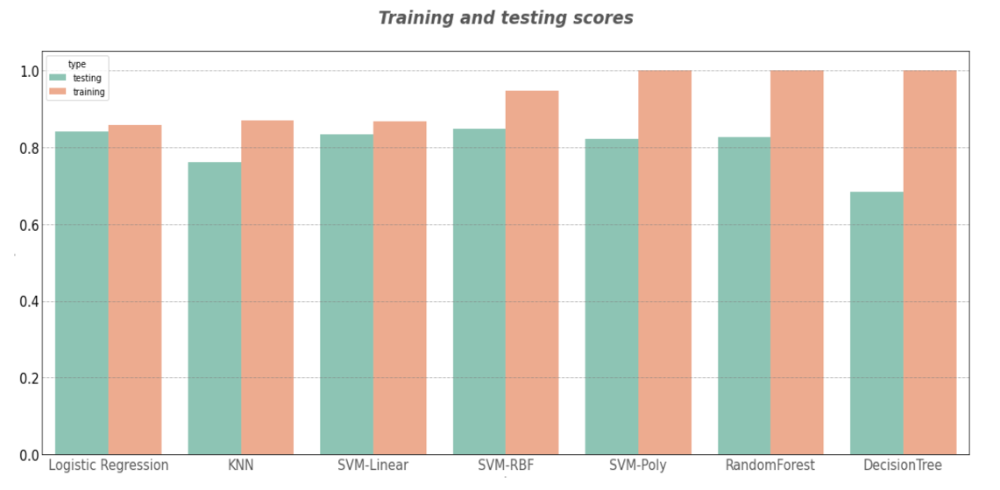

The test data showed the best results by logical regression and SVM RBF models.

Since logistic regression corresponds to a single-layer neural network, I decided that these data are pretty suitable to build this neural network using python and get a satisfactory result in predicting gender by voice.

To understand how a neural network is built, learned, and evaluated, I decided to create it without using special libraries. There will be **32 incoming neurons**, then a **hidden layer**, then a **layer of outgoing neurons**, of which one neuron is the **probability** that the **voice is male**, and the other is that the **voice is female**. Additionally, I introduced such hyperparameters as the learning rate and the number of epochs and again divided the database into training and test.

I tried several options for the number of neurons in the middle layer and got the following results for the probability of a correct answer:

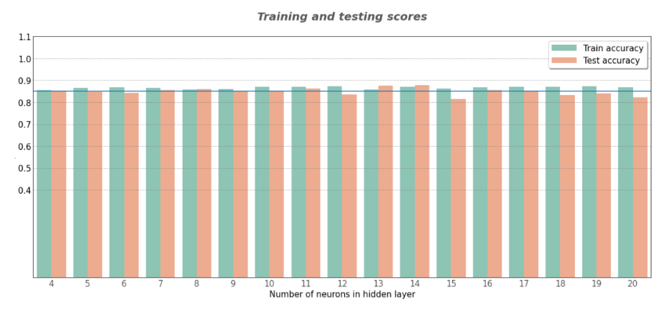

14 neurons in the middle layer showed the best results. 0.8700 on the training network and 0.8779 on the test one.The neural network is interesting because I can experiment with hyperparameters for a long time, get the most satisfying result, and see how it works on new data.

Of course, I recorded my voice. According to the network results, it is **female** with a probability of **0.9865**, and my husband's voice is **male** with a probability of **0.9842**.

### S7 - COMMUNICATE PROBLEMS, RECOMMENDATIONS AND INSIGHTS ADAPTED TO THE INTENDED TARGET AUDIENCE

Before preparing a presentation, I need to answer three questions: “What size is my audience? Who is in the audience? How much knowledge do they have about your topic? Why are they attending my presentation?”

The audience is **HI students**, some of them from the Data Analyst program, some from the AI ​​Business Consultant program, and some from the Frontend developer program. While preparing the presentation, I didn’t know whether all three groups would be together at the presentation, so by default, I was guided by all three.

People watch movies for two purposes: **entertainment** and **education**. My audience may be interested in learning how to work with sound, and an element of entertainment can be added using video/audio examples.

At the start of the presentation, I will inform the audience about what topic I chose for the project and why. My presentation consisted of three parts that I thought would be interesting for my audience and help convey the process of my work on the project.

1) Part one is devoted to how the features of our voice are formed, what determines them, and how we hear. The points that I thought were important in this part are the **voice mutation** during adolescence in boys and girls, to show why we **can perceive voices as feminine and masculine after this age**, as well as the importance of the **cochlea** in our ear, which decomposes the sound signal into frequencies and transmits it to the neurons corresponding to the frequency of the signal.
   Part1. Presentation

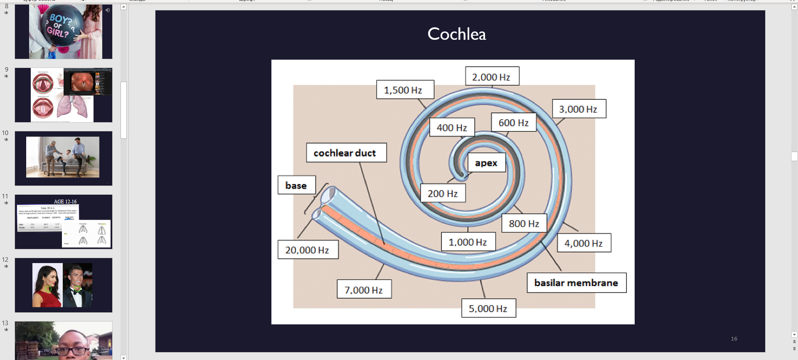

2) The second part of my presentation is devoted to the librosa library. I will show what possibilities it provides for working with sound and what a spectrogram and a **mel spectrogram** are. I think this will be interesting to my audience since any work with sound in the field of training neural networks for speech recognition, speech synthesis, voice recognition, and so on begins with this.
   Part 2. Presentation

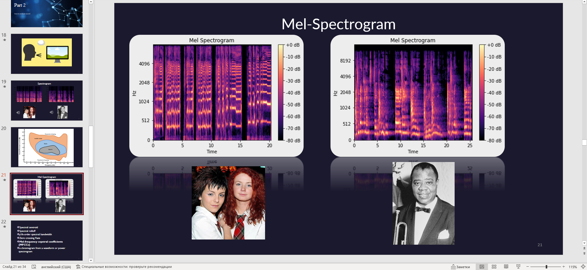

3) The third part of my presentation is devoted to the result of my work on the project. There are graphs of the work’s results of different classification models, the results of the neural network’s work with a different number of neurons in the hidden layer, as well as how the neural network coped with my and my husband's voice.
   Part3. Presentation

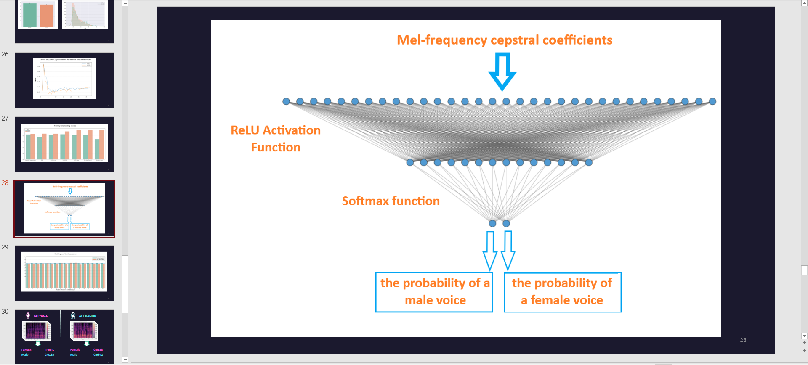

For clarity, I drew a neural network model and visualized all the results. I used the stars' voices (very high and low) to show clearly how the spectrogram is formed.

**My main message to the audience is that working with voice is fascinating. My second message to the audience is that when training a neural network, you should never forget what data you are using. A neural network, like a person, can make mistakes.**

<h2 align="center">Thank you!</h2>

<h6 align="right">Tatyana Ketova, tatyana.ketova@hyperisland.se</h6>
